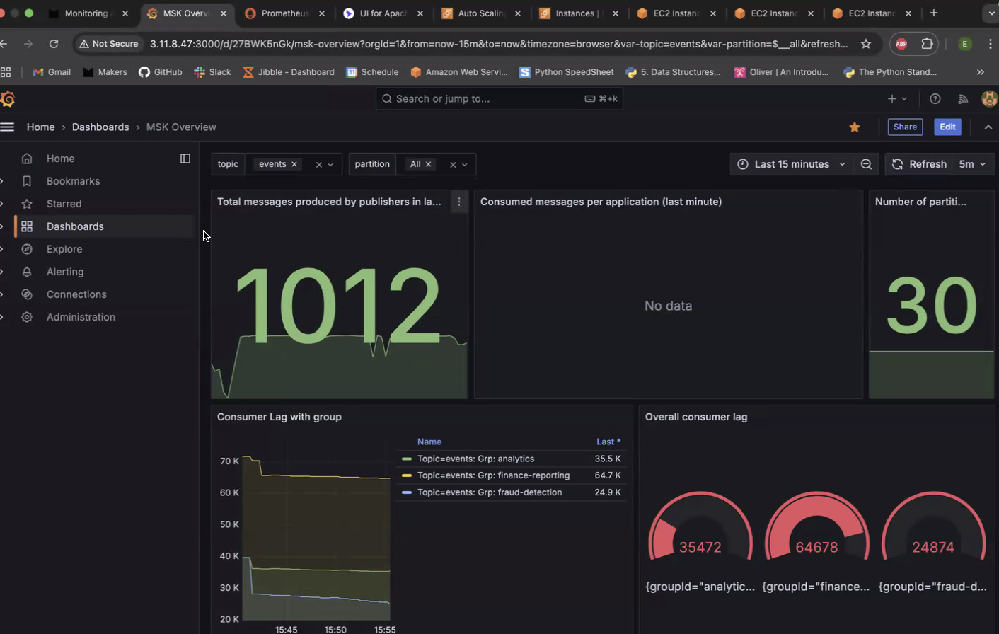
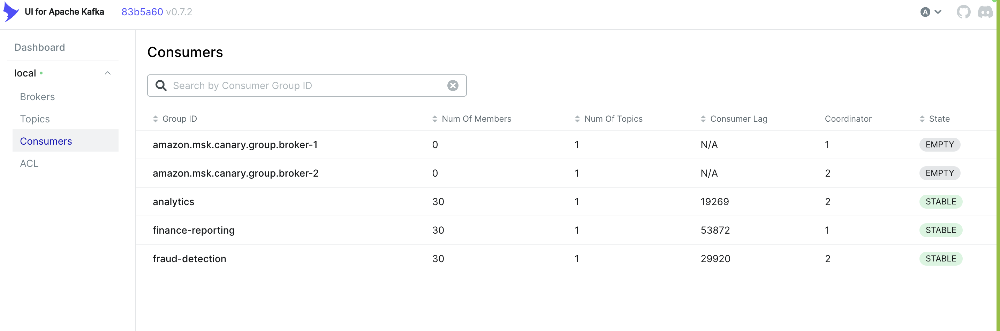
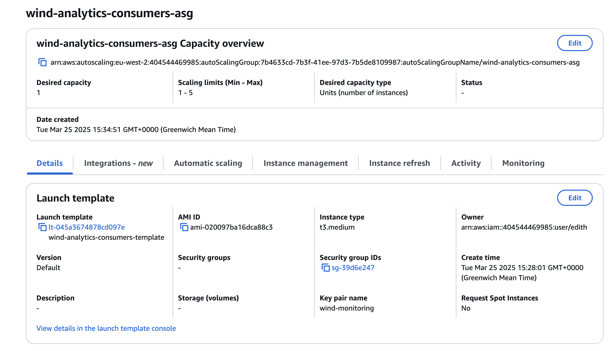
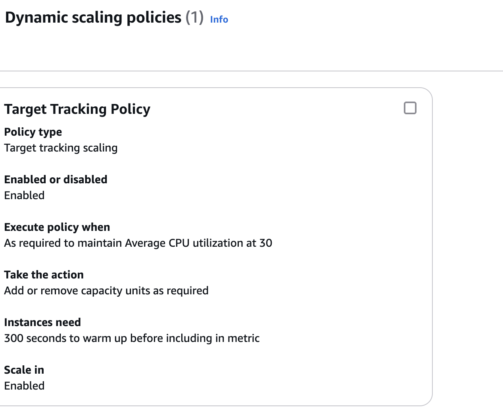
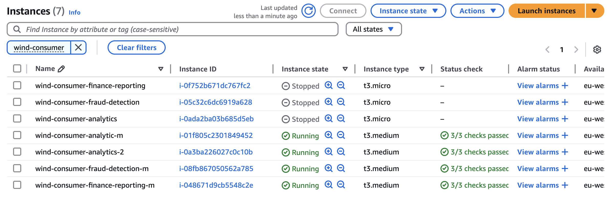
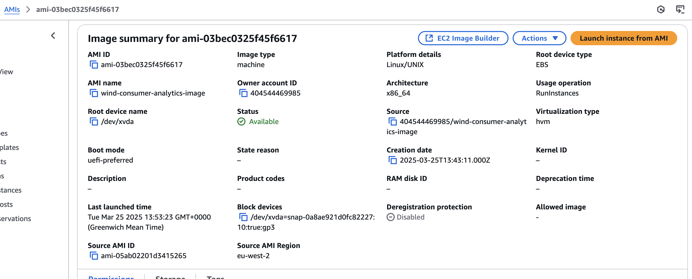
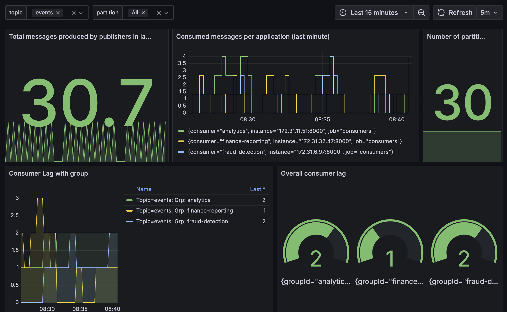

# 📈📊 Scaling Data Infrastructure – Research Project 📊📈

## Contributors

- Edith Cheler - [@edithche](https://github.com/edithche)
- Dilan Patel - [@diliano](https://github.com/diliano)
- Rama Sane - [@ramapaudyal](https://github.com/ramapaudyal)
- Oli Kelly - [@olikelly00](https://github.com/olikelly00)

---
## Project Overview

With this project, we've applied what we've learned about streaming data pipelines and cloud computing, extending this knowledge to think critically about how to make cloud-hosted data pipelines scalable and performant.

As a business grows, so does the amount of data its pipelines need to process. Ensuring that the business's infrastructure can handle this growth without sacrificing performance or cost-efficiency is crucial.

---
## What are common performance bottlenecks in data streaming pipelines?

- The volume of data becomes too large for the current infrastructure to handle  
- Underpowered infrastructure for processing-heavy tasks (e.g., ML model inference)  
- Geographically distributed data creates latency and cost issues if infrastructure is not colocated  
- High throughput from many producers or a single heavy-load producer  
- Too many consumers attached to a single stream  
- Consumers lag behind producers and can't process data fast enough (latency issues)

Thanks to using Prometheus and Grafana to get visibility of our data pipeline's performance, we can see that before solving these bottlenecks, our pipeline huge lag between messages received from producer applications and messages processed by consumer applications:

*Before scaling: Grafana representation of high levels of lag in our data pipeline*

---
## What are some common corrective actions to solve scalability issues? 

### Horizontal Scaling  
*Creating more instances of your application to share the load.*

**Parallel Processing**

- Spinning up multiple instances of your program to handle data in parallel. This increases throughput and reduces latency. 

*Diagram to explain increasing the partition count of our MSK cluster and its impact on performance*

- To enable parallel processing in Kafka, we needed to **increase the partition count**. This is because processes (or consumers) in a consumer group can only read from one partition at a time. If your topic has only one partition, only one consumer can actively process data — even if you have multiple instances running. 
- By increasing the number of partitions, we allow multiple copies of the consumer application to work in parallel, each assigned to a separate partition. This unlocks true parallelism and helps the system keep up with high-throughput data streams. Here's a diagram to represent this change:
- This also involved
- In our project, we implemented parallel processing on all three consumer applications, so that each can run 30 copies of their respective program simultanesouly. Here is a screenshot of KafkaUI (a visualisation tool for Kafka streaming processes), to demonstrate the number of proceeses running in parallel on each server.

*Evidence of parallel processing across three EC2s*

**Server Replication**

- Running multiple identical copies of your servers to balance the workload evenly. As an example, we replicated our AWS EC2 instance running an analytics consumer application:

  > *Insert screenshot of EC2 instance replication*

**Auto-Scaling Groups (ASGs)**

- Configuring autoscaling to increase capacity during peak usage and reduce it during quiet periods. 
- This improves cost-efficiency and performance on demand. Since autoscaled machines are ephemeral (can start or stop anytime), it's important to use pre-built AMIs for faster, consistent setup without manual configuration.
- As an example, we created an Auto scaling group on EC2, configuring minimum, maximum and desired capacity. We then adapted this to include a dynamic scaling policy.

*evidence of our Auto-Scaling Group setup*

*evidence of our dynamic scaling policy set up for ASG*

**Dockerising Consumer Applications**

- Containers allow lightweight, portable application packaging. Dockerised apps can be deployed quickly and consistently across multiple servers.

---

### Vertical Scaling  
*Upgrading existing resources to be more powerful.*

**Upgrading Servers**
- Replacing smaller EC2 instances (e.g. `t3.micro`) with more powerful ones (e.g. `t3.medium`).

*Evidence of upgrading our EC2 instances from micro to medium*

  This involves:
  1. Creating an AMI image of the original instance
  2. Spinning up a new EC2 instance using that AMI
  3. Reconfiguring IAM permissions and security groups

*Evidence of the AMI image we created in order to quickly replicate servers quickly*

**Understanding What to Upgrade**:
 - **CPU**: if the program runs on a faster CPU, it's more efficient.
 - **Memory (RAM)**: some DBs hold most of their data in memory to help with faster data retrieval. More memory = better performance.
  - **I/O**: Critical for frequent reads/writes to disk, calling APIs, or read/writes to remote databases

**Limitations of Vertical Scaling**:
- It's more expensive as your needs grow  
- There's a ceiling — servers can only get so powerful  
- Downtime may be needed to retire and replace servers  
- Risk of duplicate records if both old and new pipelines run simultaneously

## Impact of Vertical & Horizontal Scaling techniques

Thanks to using Prometheus and Grafana to get visibility of our data pipeline's performance, we can see that by applying horizontal and vertical scaling techniques to our project, we reduceds the lag to minimal levels.

*After scaling: Grafana representation of low levels of lag in our data pipeline*

---
## So what does a **scalable** data infrastructure look like?

A scalable data infrastructure is one that can **grow horizontally and vertically** to meet increasing demands. It includes:

- Containerised applications that can be deployed and scaled easily  
- Auto-scaling infrastructure that adapts to changes in load  
- Strategically places servers so that they're located geographically close to where data sources are hosted.
- Monitoring tools to track throughput, lag, and resource usage (eg. Prometheus, Grafana)  

This design ensures your data pipeline stays performant even as data volume and complexity grow, and allows you to track performance of your pipeline as it scales.

---
## What does a **high-availability** data infrastructure look like?

A high-availability data infrastructure is one that stays **resilient and operational**, even during outages or spikes in traffic. This includes:

- **Redundancy**: Multiple instances running in parallel to reduce single points of failure  
- **Failover mechanisms**: Automatically redirect traffic to healthy services when others fail  
- **Ephemeral, quickly reproducible infrastructure**: Using AMIs and Docker to ensure fast, consistent redeployment  
- **Monitoring and alerting**: Proactive response to infrastructure failures  

We can see several examples of high-availability being implemented in this project:

1. **Parallel consumer scaling enabled by Kafka partitioning** to prevent single-consumer bottlenecks and allows failover within the consumer group
**Replicating EC2 consumer servers** to ensure continued service if one instance goes down  
2. **Auto Scaling Groups** that automatically launch new instances when traffic spikes or failures occur  
3. **Pre-built AMIs** that allow rapid redeployment of identical environments, reducing downtime  
4. **Dockerised consumer apps**, which ensure portable, consistent behaviour across multiple environments

---
## Scalability, Performance, and Cost-Efficiency in the Cloud

Cloud-hosted infrastructure allows for flexibility, but comes with trade-offs:

| Factor          | Pros                                           | Cons                                                  |
|-----------------|------------------------------------------------|-------------------------------------------------------|
| **Scalability** | Adapt to growing data and user needs          | Complex to manage, risk of overprovisioning           |
| **Performance** | Better processing speed, lower latency        | Often requires costlier compute resources             |
| **Cost**        | Pay-as-you-go, can optimise over time         | Spikes in cost if scaling is not managed carefully    |

All things considered, here's how we think you can strike the right balance:
- Use **horizontal scaling** for flexibility and resilience  
- Use **vertical scaling** strategically, only when necessary  
- Always **monitor usage** to understand your data pipeline's limite factors
- Apply **autoscaling** using built-in cloud functionality (eg. AWS ASGs) to keep costs in check. 

---
## In Summary...

This research project helped us understand:
- How bottlenecks form in data pipelines  
- How to design and implement scaling strategies  
- The interplay between cost, performance, and availability in cloud-based infrastructure  

We applied this by simulating real-world upgrades using AWS EC2, AMIs, Docker, and Auto Scaling Groups.

